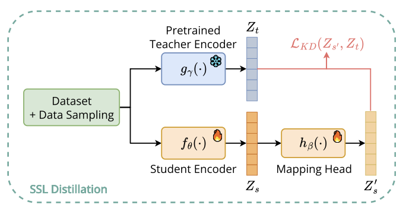
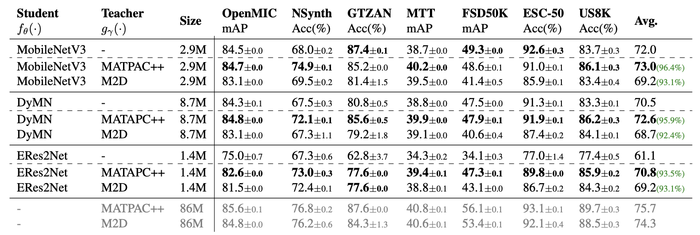
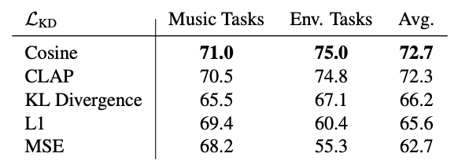
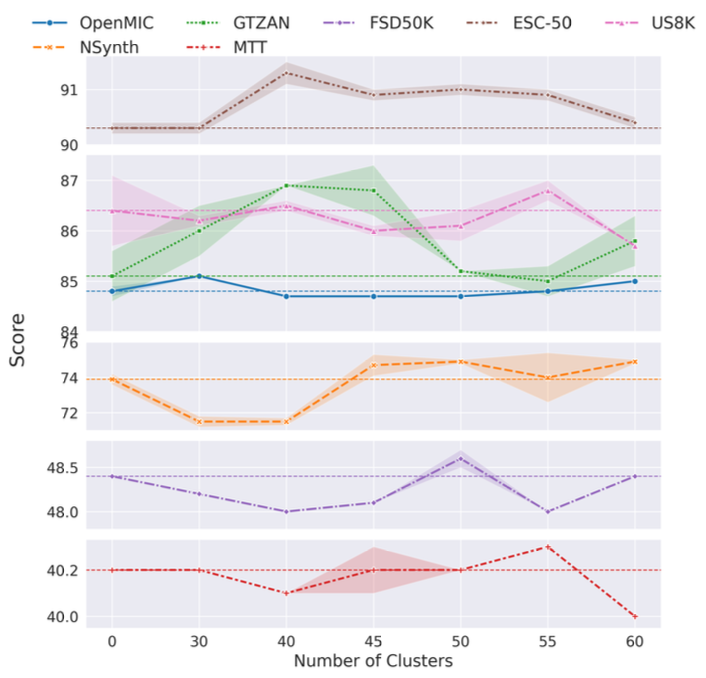

<div align="center">

# S-SONDO

### Self-Supervised Knowledge Distillation for General Audio Foundation Models

**ICASSP 2026**

<a href="https://arxiv.org/"></a>&nbsp;
<a href="https://huggingface.co/mohammedali2501/ssondo"></a>&nbsp;
<a href="https://pypi.org/project/ssondo/"></a>&nbsp;
<a href="LICENSE"></a>&nbsp;
<a href="https://python.org"></a>

[Paper](https://arxiv.org/) | [Models](https://huggingface.co/mohammedali2501/ssondo) | [PyPI Package](https://pypi.org/project/ssondo/) | [Training Code](#training) | [Notebooks](#notebooks)

</div>

---

S-SONDO is the first framework for **self-supervised knowledge distillation** of general audio foundation models. It distills large teacher models into lightweight students that are **up to 61x smaller** while retaining **up to 96% of teacher performance**, using only output embeddings, no logits or layer-level alignment required.

<div align="center">


*Fig. 1. Overview of the proposed S-SONDO framework. The student embeddings are mapped and aligned with the teacher embeddings in the teacher's latent space through self-supervised knowledge distillation.*
</div>

## Key Results

Downstream evaluation across **7 audio tasks** (4 music + 3 environmental sound). Students retain up to **96.4%** of teacher performance while being up to **61x smaller**.

<div align="center">


*Table 1. Downstream evaluation of S-SONDO with 95% Confidence Intervals (CI). We report the performance of our Knowledge Distillation method across teacher-student combinations. For each student model, supervised training results are reported as a reference (lines where MobileNetV3, DyMN, and ERes2Net have no teacher model). Bold values indicate the best result for each student between supervised and distillation training. Greyed values correspond to teacher performance, and green numbers denote the percentage of teacher performance achieved by the student.*
</div>

### Loss Function Comparison

<div align="center">


*Table 2. Loss choice for S-SONDO*
</div>

### Balanced Data Sampling (BDS) Ablation

<div align="center">


*Fig. 2. Ablation on the number of clusters for the Balanced Data Sampling. The fixed dashed line is the random sampling baseline.*
</div>

## Repository

This repository is organized into three main folders:

| Folder | Description |
|--------|-------------|
| [`inference_ssondo/`](inference_ssondo/) | **PyPI package** (`pip install ssondo`) — lightweight inference and finetuning with pretrained S-SONDO models. Auto-downloads checkpoints from [Hugging Face Hub](https://huggingface.co/mohammedali2501/ssondo). |
| [`training_ssondo/`](training_ssondo/) | **Training pipeline** — full 4-step workflow to reproduce the paper: download AudioSet, extract teacher embeddings, cluster, and train student models via knowledge distillation. One-command setup with `./setup.sh`. |
| [`notebooks/`](notebooks/) | **Evaluation notebooks** — clustering analysis (t-SNE, UMAP, NMI) and linear probe / finetuning on ESC-50. Uses `ssondo` from PyPI, no local setup needed. |

## Citation

If you use S-SONDO in your research, please cite:

```bibtex
@inproceedings{eladlouni2026ssondo,
  title={S-SONDO: Self-Supervised Knowledge Distillation for General Audio Foundation Models},
  author={El Adlouni, Mohammed Ali and Quelennec, Aurian and Chouteau, Pierre and Peeters, Geoffroy and Essid, Slim},
  booktitle={IEEE International Conference on Acoustics, Speech and Signal Processing (ICASSP)},
  year={2026}
}
```

## License

This project is licensed under the MIT License. See [LICENSE](LICENSE) for details.

## Acknowledgments

- [MATPAC](https://github.com/aurianworld/matpac) — Teacher model
- [M2D](https://github.com/nttcslab/m2d) — Teacher model
- [EfficientAT](https://github.com/fschmid56/EfficientAT) — Student architectures (MobileNetV3, DyMN)
- [AudioSet](https://research.google.com/audioset/) — Training data
