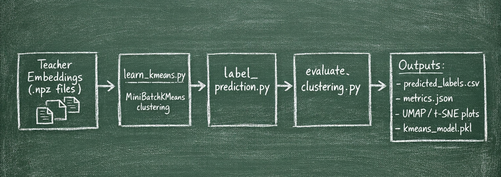

# Clustering Teacher Embeddings

This module implements a complete pipeline for clustering teacher model embeddings to create structured knowledge representations for knowledge distillation.

## Pipeline Overview


The following diagram illustrates the clustering flow:




The pipeline processes teacher embeddings through three main stages:

1. **Clustering Training** (`learn_kmeans.py`) - Trains a MiniBatchKMeans model on teacher embeddings
2. **Label Prediction** (`label_prediction.py`) - Assigns cluster labels to all embeddings
3. **Evaluation** (`evaluate_clustering.py`) - Computes clustering metrics and generates visualization data

The pipeline takes teacher embeddings extracted from AudioSet (via the `extract_teachers_knowledge` module) and clusters them into structured groups that can be used for knowledge distillation.

## Prerequisites

- Python environment with required dependencies (PyTorch, scikit-learn, numpy, pandas, tqdm, matplotlib, umap-learn, etc.)
- Teacher knowledge embeddings extracted and available at `$DATA/teachers_knowledge/{model_name}/window_length_{win_len}s/embed/`
- AudioSet dataset metadata available at `$DATA/AudioSet`
- Environment variables `DATA` and `OUTPUTS` set to your data and output directories

## Directory Structure

```
cluster_teachers_embeddings/
├── learn_kmeans.py               # Train clustering model
├── label_prediction.py           # Predict cluster labels
├── evaluate_clustering.py        # Evaluate clustering quality
├── results.ipynb                 # Interactive analysis notebook
├── config.py                     # Configuration definitions
├── dataset.py                    # Dataset loading utilities
├── utils.py                      # Helper functions
└── README.md                     # This file
```

## Main Clustering Function

The core clustering algorithm is **MiniBatchKMeans** from scikit-learn, which provides memory-efficient clustering for large datasets. MiniBatchKMeans is a variant of the K-Means algorithm that uses mini-batches to reduce computation time while still attempting to optimize the same objective function.

### MiniBatchKMeans Initialization

The model is initialized with the following parameters (as defined in `config.py` and used in `learn_kmeans.py`):

```python
kmeans = MiniBatchKMeans(
    n_clusters=conf["n_clusters"],              # Number of clusters (default: 50)
    init=conf["init_method"],                   # Initialization method (default: "k-means++")
    max_iter=conf["max_iter"],                  # Maximum iterations per run (default: 100)
    batch_size=conf["batch_size"],             # Mini-batch size for partial_fit (default: 10000)
    verbose=conf["verbose"],                    # Verbosity level (default: 1)
    compute_labels=conf["compute_labels"],      # Compute labels & inertia (default: True)
    random_state=conf["seed"],                  # Random seed for reproducibility (default: 42)
    tol=conf["tol"],                           # Tolerance for early stopping (default: 0)
    max_no_improvement=conf["max_no_improvement"],  # Early stopping patience (default: 100)
    init_size=conf["init_size"],               # Size of init sample (default: None, uses heuristic)
    n_init=conf["n_init"],                     # Number of random initializations (default: 10)
    reassignment_ratio=conf["reassignment_ratio"]  # Fraction of centers to reassign (default: 0.0)
)
```

## Usage

### Basic Usage

Run the pipeline from the `training_ssondo` directory:

#### 1. Train Clustering Model

Train a MiniBatchKMeans model on teacher embeddings:

```powershell
PS D:\new_projects\ssondo\training_ssondo> uv run -m cluster_teachers_embeddings.learn_kmeans --conf_id 50_clusters_fit_matpac
```

This will:
- Load teacher embeddings from the configured path
- Train the clustering model using either `fit()` or `partial_fit()` based on configuration
- Save the model to `{exp_dir}/{n_clusters}_clusters/kmeans_model.pkl`
- Generate inertia history plots and save training metrics

#### 2. Predict Cluster Labels

Assign cluster labels to all embeddings:

```powershell
PS D:\new_projects\ssondo\training_ssondo> uv run -m cluster_teachers_embeddings.label_prediction --conf_id 50_clusters_fit_matpac
```

This will:
- Load the trained clustering model
- Predict cluster labels for all embeddings in the dataset
- Save predictions to `{exp_dir}/{n_clusters}_clusters/predicted_labels.csv`

#### 3. Evaluate Clustering

Compute clustering metrics and generate visualization data:

```powershell
PS D:\new_projects\ssondo\training_ssondo> uv run -m cluster_teachers_embeddings.evaluate_clustering --conf_id 50_clusters_fit_matpac
```

This will:
- Compute clustering metrics (silhouette score, Calinski-Harabasz, Davies-Bouldin)
- Generate t-SNE and UMAP data for visualization
- Save metrics and visualization data to the experiment directory


## Output Format

Results are saved in the following directory structure:

```
$OUTPUTS/clustering/
└── {teacher_model_name}/
    └── {n_clusters}_clusters/
        ├── kmeans_model.pkl              # Trained clustering model
        ├── cluster_centers.npy           # Cluster center coordinates
        ├── predicted_labels.csv          # Audio ID → Cluster ID mappings
        ├── inertia_history.npy           # Training convergence history
        ├── inertia_history.csv           # Inertia history (CSV format)
        ├── inertia_plot.png              # Training convergence plot
        ├── config.yaml                   # Configuration used for training
        ├── metrics.json                  # Clustering evaluation metrics
        ├── tsne_data.csv                 # t-SNE coordinates for visualization
        └── umap_data.csv                 # UMAP coordinates for visualization
```

## Configuration

To create a custom configuration, edit `config.py` and add a new entry to the `conf` dictionary. Each configuration should specify:

```python
"your_conf_id": {
    "n_clusters": 50,
    "use_fit": True,  # True for fit(), False for partial_fit()
    
    "dataset": {
        "teacher_knowledge_path": os.path.join(
            os.environ["DATA"],
            "teachers_knowledge",
            "MODEL_NAME",
            "window_length_10s",
            "embed",
        ),
        "subset": "all",  # "train", "eval", or "all"
        "sample_size": 1,  # Fraction of dataset used if using fit()
    },
    
    "exp_dir": os.path.join(
        os.environ["OUTPUTS"],
        "clustering",
        "MODEL_NAME",
    ),
    
    # Clustering parameters (inherited from common_parameters)
    "init_method": "k-means++",
    "batch_size": 10000,
    "max_iter": 100,
    # ... other parameters
}
```

## Notes

- The dataset automatically filters to only include files that exist on disk
- For large datasets, use `use_fit=False` to enable incremental training with `partial_fit()`
- Clustering metrics are computed on a sampled subset of the data for efficiency
- Visualization data (t-SNE/UMAP) is generated on a sampled subset (default: 2000 samples)
- The script automatically uses the configured batch size for memory-efficient processing
- Processing progress is displayed with progress bars showing batch information
- All random operations use a fixed seed (42) for reproducibility

## Troubleshooting

**Issue: `DATA` or `OUTPUTS` environment variable not set**
- Solution: Set the `DATA` and `OUTPUTS` environment variables to your data and output directories before running

**Issue: Teacher knowledge files not found**
- Solution: Verify that teacher embeddings have been extracted using the `extract_teachers_knowledge` module and are available at the configured path

**Issue: Out of memory errors during training**
- Solution: Set `use_fit=False` in the configuration to use incremental `partial_fit()` training, or reduce `sample_size` if using `fit()`

**Issue: Clustering metrics computation fails**
- Solution: Ensure the number of clusters is less than the number of samples in the evaluation subset, or reduce `clustering_metrics.sample_size` in the configuration

**Issue: Slow t-SNE/UMAP computation**
- Solution: Reduce `visualization.tsne.n_samples` or `visualization.umap.n_samples` in the configuration to use fewer samples for visualization
