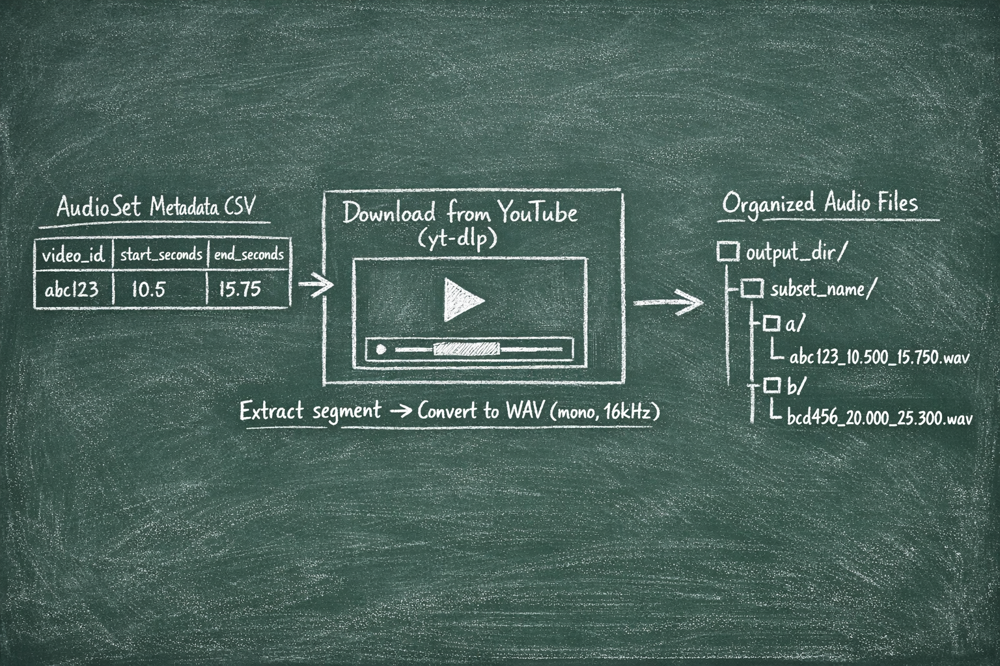

# Download Subset of AudioSet

Downloads AudioSet audio clips from YouTube using `yt-dlp`. Audio files are downloaded in **.wav format** (mono, 16kHz).

## Pipeline Overview

The following diagram illustrates the download pipeline:



The pipeline processes AudioSet metadata CSV files, downloads the corresponding video segments from YouTube using `yt-dlp`, extracts the specified time segments, converts them to WAV format (mono, 16kHz), and organizes them into a directory structure.

## Main Entry Point

```python
download_subset_of_audioset(
    metadata_csv: str,           # Required: Path to AudioSet metadata CSV
    subset_name: str,            # Required: Output subdirectory name
    n_clips: int,                # Optional: Number of clips to download (default: 5)
    random_state: int = 42,      # Optional: Random seed (default: 42),   
    max_workers: int = 5,        # Optional: Number of parallel workers (default: 5),
    output_dir: Optional[str] = None  # Output directory (default: $DATA/AudioSet)
) -> dict
```

## Command Line Usage 
Run this command from the `training_ssondo` directory.
```powershell
uv run -m 000_download_subset_of_audioset.download_audioset --metadata-csv <path> --subset-name <name> [--n-clips <num>] [--output-dir <path>] [--max-workers <int>]
```

**Example:**
```powershell
uv run -m 000_download_subset_of_audioset.download_audioset --metadata-csv D:\new_projects\ssondo\training_ssondo\data\AudioSet\eval_segments.csv --subset-name eval --n-clips 10
```

## Output Format

Audio files are downloaded in **.wav format** (mono, 16kHz).

- Files are saved with the format: `{video_id}_{start_time:.3f}_{end_time:.3f}.wav`
- Each file is placed in a subdirectory named after the first character of the video ID
- Special characters (`-`, `_`, `.`) are grouped into a subdirectory named `-`

**Example directory structure:**
```
output_dir/
  subset_name/
    a/
      abc123_10.500_15.750.wav
    b/
      bcd456_20.000_25.300.wav
    -/
      -xyz789_5.000_10.000.wav
```
