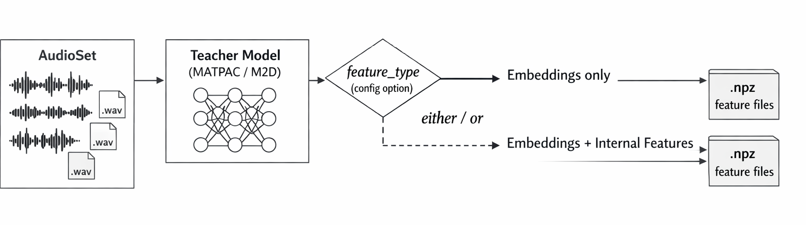

# Extract Teachers Knowledge

This module extracts teacher model knowledge from the AudioSet dataset. For each audio file, it saves embeddings and/or intermediate layer outputs as `.npz` files for use in knowledge distillation.

## Pipeline Overview

The following diagram illustrates the feature extraction pipeline:



The pipeline processes AudioSet audio files through a Teacher Model (MATPAC or M2D), and based on the `feature_type` configuration option, outputs either embeddings only or embeddings plus internal features into `.npz` feature files.

## Prerequisites

- Python environment with required dependencies (PyTorch, torchaudio, numpy, tqdm, yaml, etc.)
- AudioSet dataset downloaded and available at `$DATA/AudioSet` (defaults to `training_ssondo/data/AudioSet`)
- Teacher model checkpoints available (MATPAC, M2D, etc.) in the `models/teachers/` directory
- (Optional) Environment variable `DATA` set to your data directory

## Usage

### Basic Usage

Run this command from the `training_ssondo` directory:

```bash
uv run -m training_ssondo.extract_teachers_knowledge.audioset_feature_extraction --conf_id matpac_mcl_eval
```

### Available Configurations

The following `conf_id` values are available in `config.py`:

- **`matpac_mcl_train`**: Extract MATPAC_MCL embeddings from AudioSet training set
- **`matpac_mcl_eval`**: Extract MATPAC_MCL embeddings from AudioSet eval set
- **`m2d_train`**: Extract M2D embeddings from AudioSet training set
- **`m2d_eval`**: Extract M2D embeddings from AudioSet eval set

### Feature Types

Configure the `feature_type` in your config to extract:
- **`embed`**: Only embeddings (default for most models)
- **`all`**: Embeddings + intermediate layer outputs
- **`logits`**: Only logits (for classification models)

Note: The feature type can be modified in `config.py` for each configuration.

## Output Format

Features are saved in the following directory structure:

```
$DATA/teachers_knowledge/
└── {model_name}/
    └── window_length_{win_len}s/
        └── {feature_type}/
            └── {dataset_set}/
                ├── {file_id}.npz
                └── {dataset_set}_conf.yml
```

Each `.npz` file contains:
- **`embed`**: Embedding tensor (shape varies by model)
- **`layer_outputs`**: Intermediate layer outputs (if `feature_type="all"`)
- **`logits`**: Classification logits (if available and extracted)

The configuration used for extraction is saved as `{dataset_set}_conf.yml` in the same directory.

## Directory Structure

```
extract_teachers_knowledge/
├── audioset_feature_extraction.py  # Main script for extracting features from AudioSet
├── config.py                        # Configuration settings for models and datasets
├── dataset.py                       # PyTorch Dataset class for loading AudioSet
├── models_wrappers.py               # Wrapper classes for teacher models (MATPAC, M2D)
└── README.md                        # This file
```

## Modules

### `audioset_feature_extraction.py`

Main entry point that orchestrates feature extraction using configured teacher models on AudioSet data. Handles:
- Dataset loading and batching via PyTorch DataLoader
- Model initialization and inference
- Feature extraction and saving to `.npz` files
- Configuration saving for reproducibility
- Progress tracking with tqdm

**Key Functions:**
- `main(conf)`: Main extraction pipeline that processes the entire dataset

### `config.py`

Defines configuration dictionaries for different teacher models (MATPAC_MCL, M2D) and dataset settings. Contains:
- **Model-specific parameters**: Sample rate, checkpoint paths, feature types, time dimension pooling
- **Dataset settings**: Batch size, subset selection (train/eval), audio duration, shuffle settings
- **Processing parameters**: Number of workers, prefetch factor, persistent workers, pin memory
- **Audio slicing parameters**: Window length, step size, add_last flag
- **Save directory**: Automatically set to `$DATA/teachers_knowledge/`

**Common Parameters:**
- `num_workers`: 4 (for data loading)
- `prefetch_factor`: 2
- `persistent_workers`: True
- `pin_memory`: False

### `dataset.py`

Implements `AudiosetDataset` class for loading and preprocessing AudioSet audio files. Features:
- **Label aggregation and caching**: Aggregates multiple labels per file and caches results
- **Audio loading and resampling**: Automatically resamples to target sample rate (default 16000 Hz)
- **Subset support**: Supports train/eval/all subsets
- **Automatic filtering**: Filters to only include 10s audio clips and files that exist on disk
- **Mono conversion**: Automatically converts multi-channel audio to mono

**Key Methods:**
- `__getitem__(index)`: Returns file path and audio tensor
- `load_set(pdf, subset)`: Loads and filters metadata for specified subset
- `load_audio_tensor(file_path)`: Loads and preprocesses audio file

### `models_wrappers.py`

Provides `ModelWrapper` and model-specific classes (MATPAC, M2D) that handle:
- **Model loading**: Loads models from checkpoint paths
- **Audio slicing**: Automatically slices long audio files into windows
- **Feature extraction**: Extracts embeddings and intermediate layer outputs
- **Time dimension pooling**: Optionally pools time dimension for sequence models

**Supported Models:**
- **MATPAC**: MATPAC model variants (MATPAC, MATPAC_MCL, MATPAC_CLS_MCL)
- **M2D**: M2D (Music-to-Dance) model

## Configuration

To create a custom configuration, edit `config.py` and add a new entry to the `conf` dictionary. Each configuration should specify:

```python
"your_conf_id": {
    "dataset": {
        "name": "AudioSet",
        "set": "train",  # or "eval", "all"
        "audio_duration": None,  # None for 10s clips, or specific duration
        "batch_size": 4,
        "shuffle": False,
        "drop_last": False
    },
    "model": {
        "name": "MODEL_NAME",
        "sr": 16000,  # Sample rate
        "pull_time_dimension": True,
        "feature_type": "embed",  # "embed", "all", or "logits"
        "ckpt_path": "path/to/checkpoint.pt"
    },
    "slice_audio": {
        "win_len": 10,  # Window length in seconds
        "step_size": 10,  # Step size in seconds
        "add_last": True  # Whether to add last incomplete window
    }
}
```

## Notes

- Audio files longer than the configured window length are automatically sliced into overlapping windows
- The dataset automatically filters to only include files that exist on disk
- Aggregated labels are cached in `metadata_aggregated_cache.pkl` to speed up subsequent runs
- Features are saved with the same filename as the source audio file (without extension)
- The script automatically uses GPU if available, otherwise falls back to CPU
- Processing progress is displayed with a progress bar showing batch information

## Troubleshooting

**Issue: Data not found**
- Solution: Either set the `DATA` environment variable or ensure data is in `training_ssondo/data/`

**Issue: Model checkpoint not found**
- Solution: Ensure model checkpoints are in the correct location as specified in `config.py`

**Issue: AudioSet files not found**
- Solution: Verify that AudioSet dataset is downloaded and available at `$DATA/AudioSet`

**Issue: Out of memory errors**
- Solution: Reduce `batch_size` in the configuration or reduce `num_workers`
