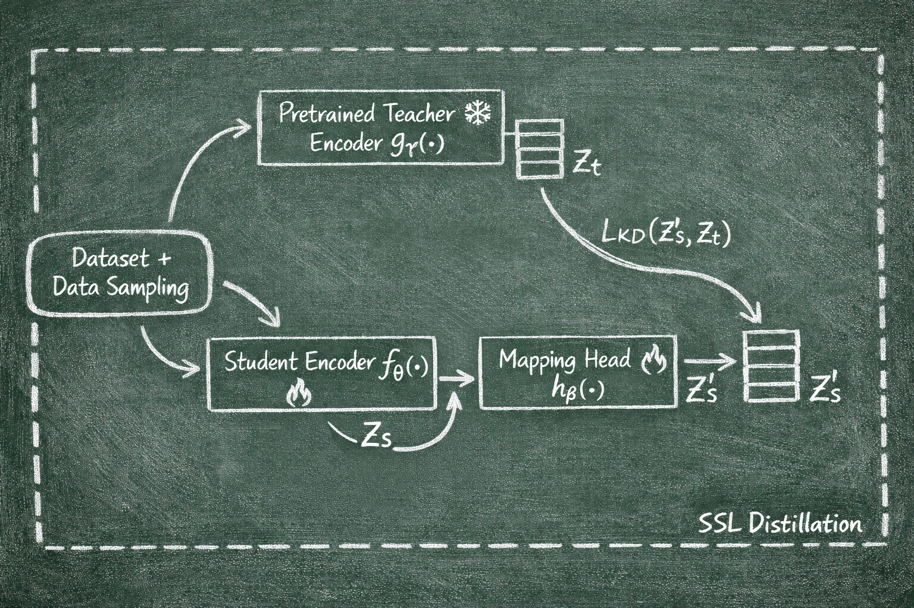

# Knowledge Distillation Training

This module implements a knowledge distillation training pipeline for training student models using precomputed teacher embeddings. The student model learns to match the teacher's embedding space through a projection head that maps the student's output to the teacher's embedding dimension.

## Pipeline Overview

The following diagram illustrates the SSONDO architecture:



The knowledge distillation training pipeline works as follows:

1. **Precomputed Teacher Knowledge**: Teacher embeddings are pre-extracted and stored as `.npz` files, eliminating the need to run the teacher model during training
2. **Student Model**: A lightweight student model (MobileNetV3, ERes2Net, or DyMN) processes audio inputs
3. **Projection Head**: A classification head (MLP, Linear, RNN, or Attention-RNN) projects the student's embeddings to match the teacher's embedding dimension
4. **Distillation Loss**: The student is trained to minimize the distance between its projected embeddings and the teacher embeddings using various loss functions

## Prerequisites

- Python environment with required dependencies (PyTorch, PyTorch Lightning, torchaudio, numpy, pandas, sklearn, etc.)
- AudioSet dataset downloaded and available at `$DATA/AudioSet`
- Precomputed teacher embeddings stored in `{teacher_knowledge_path}/{subset}/{filename}.npz` format
- Cluster labels (optional, for cluster-aware sampling and losses) available at `{cluster_dir}`
- Environment variables:
  - `DATA`: Path to data directory (contains AudioSet and teacher knowledge)
  - `OUTPUTS`: Path to experiment directory (for outputs and clustering results)

## Usage

### Basic Usage

Run this command from the `training_ssondo` directory:

```powershell
PS D:\new_projects\ssondo\training_ssondo> uv run -m knowledge_distillation_training.main --conf_id matpac_mn_cosine_50c
```

### Loss Functions

Configure the `knowledge_distillation.loss` in your config to use:

- **Standard losses**: `MSE`, `L1`, `BCEWithLogits`, `CrossEntropy`, `KLDivLoss`, `cosine_similarity`
- **Contrastive losses**: `contrastive_loss` with variants:
  - `vanilla`: Standard contrastive loss
  - `cluster_aware`: Cluster-aware contrastive loss
  - `neg_clusters`: Negative clusters only
  - `hybrid`: Hybrid cluster contrastive loss
  - `kd_loss_real_contrastive`: Real contrastive loss implementation

### Resuming Training

To resume training from a checkpoint, set `checkpoint_path` in your configuration:

```python
"checkpoint_path": "path/to/checkpoint.ckpt"
```

## Output Format

Training outputs are saved in the following directory structure:

```
{OUTPUTS}/knowledge_distillation/{teacher_model}/{student_model}/{conf_id}/{job_id}/
├── checkpoint/              # Model checkpoints (best and last)
├── conf.yml                 # Saved configuration for reproducibility
├── best_k_models.json       # Top 5 model paths with metrics
└── events.out.tfevents      # TensorBoard logs
```

Each checkpoint contains:
- Model state dictionary
- Optimizer state
- Learning rate scheduler state
- Training epoch and step information
- Validation metrics

## Directory Structure

```
knowledge_distillation_training/
├── README.md                    # This file
├── config.py                    # Configuration definitions for all experiments
├── main.py                      # Main training script entry point
├── system.py                    # PyTorch Lightning system (training/validation steps)
├── data_pipeline.py             # Data pipeline setup (preprocessing, datasets, dataloaders)
├── model.py                     # Model building functions (student model + classification head)
├── training_components.py       # Training components setup (optimizer, scheduler, losses, trainer)
├── dataset.py                   # Dataset class for loading AudioSet with teacher knowledge
├── data_augmentation.py         # Data augmentation (Mixup, SpecAugment, Normalize)
└── utils.py                     # Utility functions (samplers, schedulers, file I/O, etc.)
```

## Configuration

To create a custom configuration, edit `config.py` and add a new entry to the `conf` dictionary. Each configuration should specify:

```python
"your_conf_id": {
    "exp_dir": os.path.join(os.environ["OUTPUTS"], "knowledge_distillation", "teacher", "student"),
    
    "student_model": {
        "model_name": "mn10_im",  # or "eres2net", "dymn"
        "sr": 32000,
        "pretrained_name": "mn10_im.pt",
        "width_mult": 1.0,
        # ... other model-specific parameters
    },
    
    "classification_head": {
        "head_type": "mlp",  # "mlp", "linear", "rnn", "attention_rnn"
        "n_classes": 3840,  # Must match teacher embedding dimension
        "pooling": "mean",
    },
    
    "knowledge_distillation": {
        "loss": "cosine_similarity",  # or "MSE", "L1", "contrastive_loss", etc.
        "temperature": 1,
        "lambda": 0.5,  # Weight: lam * pred_loss + (1 - lam) * kd_loss
    },
    
    "dataset": {
        "teacher_knowledge_path": os.path.join(os.environ["DATA"], "teachers_knowledge", "MATPAC_MCL", ...),
        "cluster_labels_path": os.path.join(os.environ["OUTPUTS"], "clustering", ...),
        "sampler": "WeightedRandomSamplerSSL",
        "sampler_args": {
            "num_samples": 100000,
            "replacement": True,
            "n_clusters": 50,
        },
    },
    
    "prediction_loss": "BCEWithLogits",  # or "FocalLoss", None
    
    "data_augmentation": {
        "mixup": True,
        "mixup_args": {"alpha": 0.3},
        "spec_augment": False,
    },
    
    "batch_size": 32,
    "epochs": 100,
    "optimizer": "Adam",
    "optimizer_args": {"lr": 8e-4, "betas": (0.9, 0.999), "weight_decay": 0},
    
    "lr_scheduler": "CustomScheduler",
    "lr_scheduler_args": {
        "warm_up_len": 8,
        "ramp_down_start": 80,
        "ramp_down_len": 95,
        "last_lr_value": 0.01,
    },
    
    "checkpoint_path": None,  # Path to checkpoint for resuming training
}
```

## Notes

- Teacher embeddings must be precomputed using the `extract_teachers_knowledge` module before training
- The classification head dimension (`n_classes`) must exactly match the teacher embedding dimension
- Cluster labels are optional but required for cluster-aware sampling and losses
- The pipeline automatically uses GPU if available, otherwise falls back to CPU
- Training progress is logged to TensorBoard and can be monitored in real-time
- Best models are automatically saved based on validation loss
- The job ID is automatically generated (from SLURM_JOB_ID if available, otherwise random 8-character string)
- Mixed precision training (16-bit) is enabled by default for faster training

## Troubleshooting

**Issue: `DATA` or `OUTPUTS` environment variable not set**
- Solution: Set the `DATA` and `OUTPUTS` environment variables to your data and output directories before running

**Issue: Teacher knowledge files not found**
- Solution: Ensure teacher embeddings are precomputed and available at the path specified in `teacher_knowledge_path`

**Issue: Dimension mismatch between student output and teacher embeddings**
- Solution: Verify that `classification_head.n_classes` matches the teacher embedding dimension

**Issue: Out of memory errors**
- Solution: Reduce `batch_size` in the configuration or reduce `num_workers` in `process.num_workers`

**Issue: Cluster labels not found (for cluster-aware sampling)**
- Solution: Ensure cluster labels are available at the path specified in `cluster_labels_path`, or use `RandomSampler` instead

**Issue: Checkpoint not found when resuming**
- Solution: Verify the checkpoint path is correct and the file exists

**Issue: Training loss is NaN**
- Solution: Check learning rate (may be too high), verify data preprocessing, check for corrupted teacher embeddings
