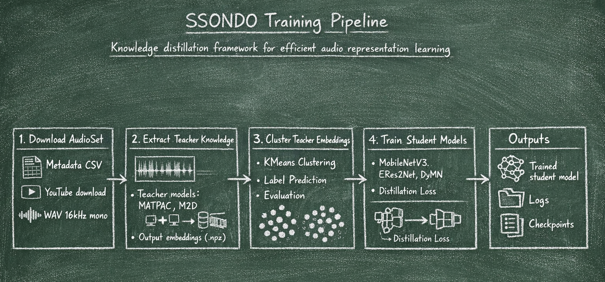

# SSONDO Training Pipeline

Self-Supervised Knowledge distillation framework for training efficient general audio representation models from large teacher models.

## Overview

The pipeline implements a four-step knowledge distillation workflow:



1. **Download AudioSet** - Downloads audio clips from YouTube
2. **Extract Teacher Knowledge** - Extracts embeddings from teacher models (MATPAC, M2D)
3. **Cluster Embeddings** - Clusters teacher embeddings for structured knowledge representation
4. **Train Student Models** - Trains lightweight models (MobileNetV3, ERes2Net, DyMN) to match teacher embeddings

## Installation

### Prerequisites

- Python >= 3.10
- [uv](https://github.com/astral-sh/uv) package manager

### Setup

1. **Install dependencies:**
```bash
cd training_ssondo
pip install uv  # if not installed
uv sync
```

2. **Set environment variables:**

```bash
# Bash
export DATA=/path/to/training_ssondo/data
export OUTPUTS=/path/to/training_ssondo/outputs
```

3. **Download required files:**

**Teacher Models** Download, extract zip file and place in `models/teachers/` (relative to project root):
- [MATPAC](https://github.com/aurianworld/matpac/releases/download/Initial_release/matpac_10_2048.pt) - `matpac_10_2048.pt`
- [M2D](https://github.com/nttcslab/m2d/releases/download/v0.1.0/m2d_vit_base-80x608p16x16-221006-mr7_enconly.zip) - `M2D_ssl.pth`

**Student Models** (place in `models/students/`):
- [MobileNetV3](https://github.com/fschmid56/EfficientAT/releases/download/v0.0.1/mn10_im.pt) - `mn10_im.pt` (pretrained on ImageNet)
- [DyMN](https://github.com/fschmid56/EfficientAT/releases/download/v0.0.1/dymn10_im.pt) - `dymn10_im.pt` (pretrained on ImageNet)
- ERes2Net - No pretrained weights (starts with random initialization)

**AudioSet Metadata** Download and place in `$DATA/AudioSet/`:
- [eval_segments.csv](http://storage.googleapis.com/us_audioset/youtube_corpus/v1/csv/eval_segments.csv)
- [balanced_train_segments.csv](http://storage.googleapis.com/us_audioset/youtube_corpus/v1/csv/balanced_train_segments.csv)
- [unbalanced_train_segments.csv](http://storage.googleapis.com/us_audioset/youtube_corpus/v1/csv/unbalanced_train_segments.csv)
- [ontology.json](https://github.com/audioset/ontology/blob/master/ontology.json)
- [class_labels_indices.csv](https://github.com/audioset/ontology/blob/master/class_labels_indices.csv)
- [metadata.csv](https://github.com/audioset/metadata/blob/master/metadata.csv)

## Data Format

- **Audio**: Mono, 16kHz WAV files
- **Spectrograms**: Log-mel, 128 bands, 0-8000 Hz, 25ms window, 10ms hop
- **Directory structure:**
```
data/AudioSet/
├── balanced_train/
├── eval/
├── unbalanced_train/
├── balanced_train_segments.csv
├── eval_segments.csv
├── unbalanced_train_segments.csv
└── ontology.json
```

## Pipeline Workflow

### Step 1: Download AudioSet Subset

```powershell
uv run python -m training_ssondo.download_subset_of_audioset.download_audioset `
    --metadata-csv $DATA/AudioSet/eval_segments.csv `
    --n-clips 1000 `
    --subset-name eval `
    --random-state 42 `
    --max-workers 5
```

**Output:** `$DATA/AudioSet/{subset_name}/`

**See:** [download_subset_of_audioset/README.md](download_subset_of_audioset/README.md)

### Step 2: Extract Teacher Knowledge

```powershell
uv run -m training_ssondo.extract_teachers_knowledge.audioset_feature_extraction --conf_id matpac_mcl_eval
```

**Configuration:** Edit `extract_teachers_knowledge/config.py`

**Output:** `$DATA/teachers_knowledge/{teacher_model}/{window_length}/{output_type}/{subset}/{filename}.npz`

**See:** [extract_teachers_knowledge/README.md](extract_teachers_knowledge/README.md)

### Step 3: Cluster Teacher Embeddings

1. **Train clustering model:**
```powershell
uv run -m training_ssondo.cluster_teachers_embeddings.learn_kmeans --conf_id 50_clusters_fit_matpac
```

2. **Predict cluster labels:**
```powershell
uv run -m training_ssondo.cluster_teachers_embeddings.label_prediction --conf_id 50_clusters_fit_matpac
```

3. **Evaluate clustering:**
```powershell
uv run -m training_ssondo.cluster_teachers_embeddings.evaluate_clustering --conf_id 50_clusters_fit_matpac
```

**Configuration:** Edit `cluster_teachers_embeddings/config.py`

**Output:** `$OUTPUTS/clustering/{teacher_model}/{n_clusters}_clusters/`

**See:** [cluster_teachers_embeddings/README.md](cluster_teachers_embeddings/README.md)

### Step 4: Knowledge Distillation Training

```powershell
uv run -m training_ssondo.knowledge_distillation_training.main --conf_id matpac_mn_cosine_50c
```

**Configuration:** Edit `knowledge_distillation_training/config.py`

**Key parameters:**
- `teacher_knowledge_path`: Path to teacher embeddings
- `cluster_labels_path`: Path to cluster assignments (optional)
- `classification_head.n_classes`: Must match teacher embedding dimension
- `knowledge_distillation.loss`: Loss type (MSE, L1, cosine_similarity, contrastive_loss, etc.)
- `knowledge_distillation.lambda`: Weight between prediction and distillation loss

**Output:** `$OUTPUTS/knowledge_distillation/{teacher_model}/{student_model}/{conf_id}/{job_id}/`

**See:** [knowledge_distillation_training/README.md](knowledge_distillation_training/README.md)

## Configuration

### Student Models
- **MobileNetV3**: Lightweight CNN architecture
- **ERes2Net**: Efficient Res2Net variant
- **DyMN**: Dynamic MobileNet with adaptive computation

### Teacher Models
- **MATPAC_MCL**: Multi-level contrastive learning model
- **M2D**: Masked Modeling Duo

### Loss Functions
- MSE, L1, Cosine Similarity
- Contrastive Loss (vanilla, cluster-aware, hybrid)
- KL Divergence (with temperature scaling)

### Data Augmentation
- Mixup
- SpecAugment (time/frequency masking)
- Normalization

## Directory Structure

```
training_ssondo/
├── readme.md
├── pyproject.toml
├── data/
│   ├── AudioSet/
│   └── teachers_knowledge/
├── outputs/
│   ├── clustering/
│   └── knowledge_distillation/
├── models/
│   ├── teachers/
│   └── students/
├── download_subset_of_audioset/
├── extract_teachers_knowledge/
├── cluster_teachers_embeddings/
├── knowledge_distillation_training/
└── utils/
    ├── audioset_loader.py
    ├── preprocess.py
    ├── portable_m2d.py
    └── student_models/
```

## Optional Environment Variables (SLURM-related):
- `SLURM_JOB_ID`: Job identification
- `SLURM_GPUS_ON_NODE`: Number of GPUs
- `SLURM_NNODES`: Number of nodes
